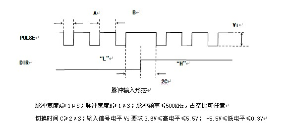
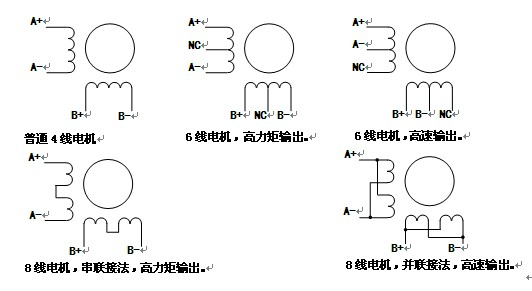
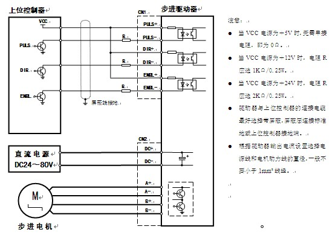
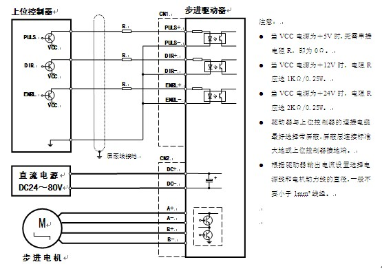
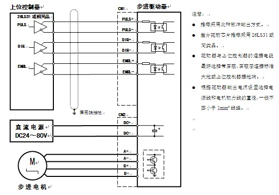

# Motor Driver Instruction

## 功能及使用

### 电源接口DC+、DC-

直流24～80VDC，通常采用线性电源（见附录：线性电源原理图）供电，用户须注意整流滤波后电源纹波电压，不可超过80VDC，以免损坏驱动器，线性电源的额定输出电流应大于驱动器设定电流的60％。当采用开关电源供电时，应注意其标称的额定输出电流，尽量选购与电机相电流匹配的开关电源。一般的，电源电压越高，电机的力矩输出越大，可避免高速丢步现象，但同时也会导致低速振动加大以及发热，使用时应根据现场机械要求合理调整供电电压。另外过高的电源电压，使驱动器母线电压基准抬高，与电机在减速制动时产生的能量回馈叠加，很容易触及驱动器高压报警阀值，产生报警现象，所以当用户选用大惯量电机时我们并不推荐用户用到80VDC。通过试验得出，最为理想的电压范围为50VDC～70VDC之间。

接线时应特别注意输入电源极性，DC+为电源正极；DC-为电源地，错误的接线可导致驱动器损坏！

为满足驱动器电磁兼容性要求，推荐使用本公司为驱动器设计的直流电源供电。

### 设定输出电流

本驱动器设计8档输出电流选择，由驱动器上的编码开关（SW1 SW2 SW3）设定，电流大小以最大值标称。SD-2H0086MB型驱动器最大可提供8.28A的输出电流，电流设定分辨率为0.91A。编码开关（SW1 SW2 SW3）组合的每一种状态代表一个电流值输出设定，具体见驱动器上的参数表。

### 自动半电流

驱动器在控制脉冲信号停止施加0.1秒左右，会自动进入半电流状态，这时电机相电流为运行时的50%，以降低功耗和保护电机，收到新的控制脉冲后驱动器自动退出半点流状态，此功能由驱动器面板上拨码开关（SW4）来设定：OFF－－自动半流有效、ON－－自动半流无效。自动半电流设定同样是必须在驱动器未加电或已加电但电机未运行时，设定完毕请关闭电源，重新上电后新参数才会有效。

### 驱动器细分设定

用户可以通过调整驱动器面板上拨码开关（SW5 SW6 SW7 SW8）的状态来设定16种细分模式。此16种细分模式基本上涵盖了用户对电机步距角的要求。具体设置参见下表或驱动器的外壳丝印面板图。细分数设定同样是必须在驱动器未加电或已加电但电机未运行时。__设定完毕请关闭电源，重新上电后新参数才会有效__。

### 保护功能

当输入电源过压、输出过流、相间短路报警中任何一个报警产生时，驱动器面板上的红色状态指示灯会亮起，同时自动切断电机使能，使电机处于脱机状态。最大限度的保护驱动器和电机的安全。

## 控制接口

### 脉冲输入接口PULS+、PULS-

步进脉冲接口PULS：步进电机驱动器把上位控制装置发出的脉冲信号转化为步进电机的角位移，驱动器每接受一个脉冲信号PULS，就驱动步进电机旋转一个步距角，PULS的频率和步进电机的转速成正比。该信号接收为标准差分接收电路，推荐指令脉冲采用差分输出方式，实际中指令脉冲也存在集电极开路输出方式，在标准接线图中我们将详细介绍。对于最佳输入要求，此信号最好是占空比1：1，脉冲信号的频率要求不大于500KHz；脉冲信号的宽度要求不小于1μS，详细要求见下图。

### 方向输入接口DIR+、DIR-

方向电平信号DIR：此信号决定电机的旋转方向。比如说，此信号为高电平时电机为顺时针旋转，此信号为低电平时电机则为反方向逆时针旋转，此种换向方式，我们称之为脉冲加方向模式。

如果驱动器输入信号为电压信号，要求：3.6V≤高电平≤5.5V； -5.5V≤低电平≤0.3V，最常用的为TTL电平。如果驱动器输入信号为电流信号，要求：7mA≤高电流≤18mA； -18mA≤低电流≤0.2mA。脉冲信号的频率要求不大于500KHz；脉冲信号的宽度要求不小于1μS；脉冲信号的驱动电流要求为7-18mA。

### 使能信号接口ENBL+、ENBL-：

使能信号ENBL：用驱动器的上下电进行电机通断电操作会使驱动器快速老化，为避免这种情况。本驱动器设计了使能信号（ENBL）输入端口，即通常所说的脱机电平信号（FREE）。用户可随时控制此信号，当此信号有效时，驱动器将自动切断电机绕组电流，使电机处于自由（不通电）状态。当此信号在不连接时默认为无效状态，这时电机绕组通过电流，可正常工作。此信号的接收电路与脉冲输入接口电路一致，此信号有效的含义为使得驱动器内部接收光耦导通。

### 电机动力输出：

本品适合驱动相电流在8.28A以下4线、6线或8线的任何一款两相或四相步进电机。电机绕组接线共有五种接法，见下图：

根据上图所示的五种接线方式，应合, 理设定驱动器输出电流，理论上电流设定越大，电机力矩输出越大，可用于避免电机高速丢步现象，但同时也会引起电机的温升。一般的，高速输出的接线方式其输出电流设定在电机额定相电流的1.4倍；高力矩输出的接线方式其输出电流设定在电机额定相电流的70％。实际应用中，应将电流设定在电机长期工作表面温升不超过+80℃的范围内。

### 标准接线图

#### NPN集电极开路脉冲控制方式：

#### PNP集电极开路脉冲控制方式：

#### 差分驱动脉冲控制方式：

